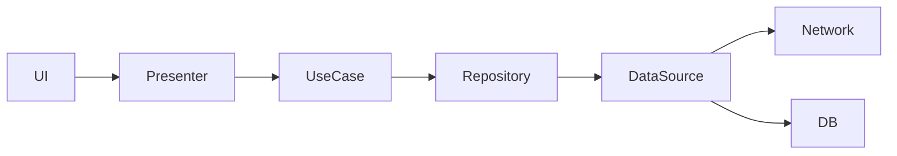

<!-- Source: monolith SKILL.md Step 10 — Phase 4: Aggregate final TDD (sections §0–§5, §7 neutral part, §13–§14, Appendices) -->

> PLATFORM-NEUTRAL. No Compose/Kotlin/SwiftUI/Hilt/Room/gradle here — those live in platform/<p>.md.

---

# TDD: <App Name>

## 0. Метаданные документа

- Версия: 1.0
- Дата: <YYYY-MM-DD>
- Платформа: <derived from platform file — see `platform/android.md`>
- Стек: see `platform/android.md`
- minSdk / target: <Q-D1, or from APK manifest if --apk supplied> / 34
- Источники анализа:
  - Скриншоты: <N> штук
  - Google Play: <url if any, else "не использован">
  - APK: <package@version if --apk supplied, else "не предоставлен">
- Глубина: <Q-A3>

---

## 1. Обзор проекта

1.1. Название и краткое описание (1 абзац — из `01_play.md` верхнего блока или из имени папки)

1.2. Целевая аудитория (Q-A1 + Play-категория)

1.3. Конкуренты — список similar_apps из `01_play.md`

1.4. Уникальные ценностные предложения (синтез описания + видимых фич)

1.5. Метрики успеха (если есть гипотезы)

---

## 2. Архитектура

2.1. Высокоуровневая диаграмма



2.2. Модули (`:app`, `:core:ui`, `:core:network`, `:core:database`, `:feature:<name>` per major feature)

> Platform-specific module/build configuration lives in `platform/android.md`. This section describes the logical module breakdown only.

2.3. Слои с обязанностями

| Слой | Обязанности |
|------|-------------|
| UI | Отображение состояния, захват событий пользователя |
| Presenter/ViewModel | Хранение UI-состояния, маршрутизация событий в UseCase |
| UseCase | Бизнес-логика, оркестрация репозиториев |
| Repository | Абстракция источника данных, offline/online политика |
| DataSource | Сеть / локальное хранилище |

2.4. Стратегия offline/network (из Q-D2):
- `no_offline` — постоянное сетевое соединение обязательно
- `read_cache` — кэш чтения, запись требует сети
- `full_offline` — полный offline + sync при появлении сети

---

## 3. Карта экранов и навигация

3.1. Список экранов с типами (из `02_business.md` — таблица)

| ID | Название | Тип | Описание |
|----|----------|-----|----------|
| S01 | ... | ... | ... |

3.2. Граф навигации (verbatim mermaid из `04_navigation.md`)

3.3. Backstack-стратегия (из `04_navigation.md`)

3.4. Deep-links (из `04_navigation.md`)

---

## 4. Спецификация каждого экрана

> Acceptance criteria: see `acceptance/*.feature`

Для каждого экрана из `02_business.md`:

### <ScreenName>

- **Назначение**: <описание>
- **Скриншот**: ``
- **Компоненты**: структура верстки + state hoisting (нейтральное описание — без Composable/SwiftUI)
- **Состояние / Событие / Действие**:
  - State: описание набора полей и их типов (`String`, `Int`, `Decimal`, `Instant`, `UUID`, `Ref<Entity>`, `List<T>`, `Boolean`, `Sealed`)
  - Event: перечень событий пользователя (user gestures → Presenter)
  - Action: одноразовые действия (навигация, snackbar, диалог)

  > Platform-specific sealed-class Kotlin snippet goes in `platform/android.md`.

- **Все состояния**: loading / empty / error / success / normal
- **Действия пользователя и обработка** (prose)
- **Навигация**: откуда, куда — со ссылкой на §3
- **Связанные API-вызовы** (со ссылкой на §9)

Объём этой секции масштабируется по mode_depth:
- `mvp`: только критичные экраны (по Q-B1), минимум сущностей
- `production`: все экраны, State/Event/Action описание, edge cases
- `reference`: + sequence-диаграммы для сложных флоу

---

## 5. Бизнес-правила

Свод из `02_business.md` (раздел "Бизнес-правила"), упорядоченный по экранам. Каждое правило с явным acceptance criteria.

---

## 7. Модель данных (из `05_data_model.md`)

7.1. ER-диаграмма

```mermaid
erDiagram
```

7.2. Сущности — нейтральные типы (String / Int / Decimal / Instant / UUID / Ref)

> Room `@Entity`/`@PrimaryKey`/`@ColumnInfo` Kotlin snippets + DAO headers + migration strategy go in `platform/android.md`.

7.3. Список сущностей с полями:

| Сущность | Поле | Тип | Описание |
|----------|------|-----|----------|

7.4. Стратегия миграций (план — нейтральный)

---

## 10. Локализация

> See `i18n.md` for the full strings inventory, plural rules, and locale file structure.

---

## 11. User stories

> See `user-stories.md` for the full list.

---

## 12. Тестовая стратегия

> Acceptance criteria: see `acceptance/*.feature` and `traceability.csv`.

---

## 13. Roadmap

- **MVP** (срок-оценка, фичи из Q-B1)
- **v1.0** (срок, фичи, выкатка в Play)
- **v1.x** — бэклог из non-MVP

---

## 14. Открытые вопросы и допущения

14.1. Допущения, сделанные при анализе (что не было видно из скриншотов — выводится из `ambiguities[]` всех агентов)

14.2. Список открытых вопросов "TODO: подтвердить с заказчиком"

---

## Приложения

- **A.** Все скриншоты (таблица: ID, файл, тип, экран, описание)
- **B.** Google Play dump (`pipeline/01_play.md`)
- **C.** APK ground-truth (`pipeline/07_apk.md`) — только если APK был предоставлен
- **D.** Pipeline files (ссылки на все `pipeline/*.md`)

---

*Сгенерировано скиллом `/app-tdd-creator` (глубина `--<mode_depth>`). Для другой глубины:*
*`/app-tdd-creator <path> --depth mvp` / `--depth production` / `--depth reference`*
